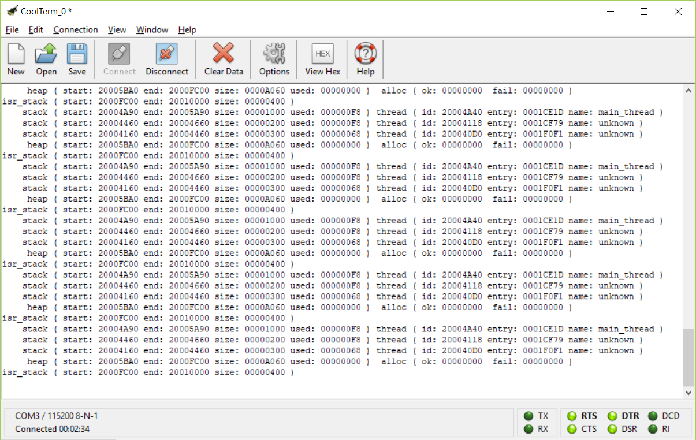
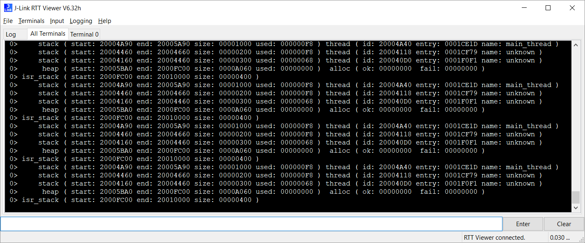
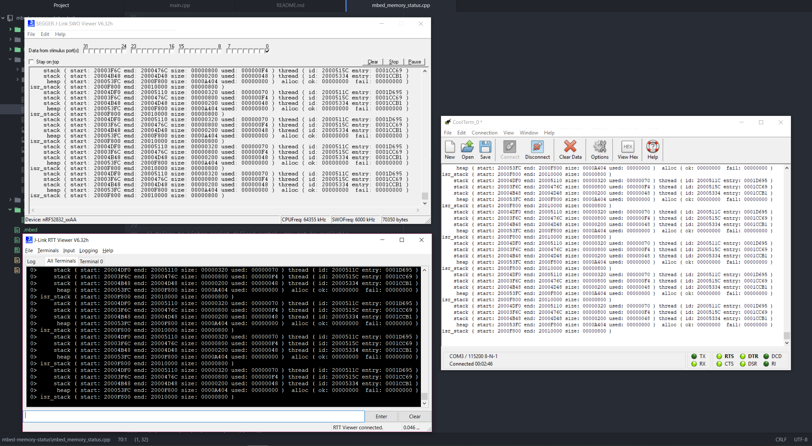

# mbed-memory-status

## Purpose

Print thread stack, ISR stack, and global heap locations, sizes, and utilization at runtime when using mbed OS. Useful for tracking down total runtime memory usage and stack overflows.

It will print debug information to the serial port, or use SEGGER Real Time Transfer (RTT), or use the Serial Wire Output (SWO) capabilities in supported ARM Cortex chips.

Does *not* use printf(). It *will* automatically initialize the default serial port to 115200 8N1 using the low-level mbed `serial_api.h` if no other instantiation has occurred.

The code has now been fixed to detect whether it is running on the CMSIS-RTOS 1 or CMSIS-RTOS 2 API and will adjust its low-level API calls accordingly.

## Example

```c
#include "mbed_memory_status.h"

int main()
{
    print_all_thread_info();
    print_heap_and_isr_stack_info();
}
```

## Building

When building the code, make sure to pass the `MBED_STACK_STATS_ENABLED` compiler macro as follows, otherwise mbed will eliminate the stack canary code:

```
mbed compile -D MBED_STACK_STATS_ENABLED=1
```

This value can also be added permanently to the `mbed_app.json` macros.

## Output

Using ARM RTX RTOS on up to mbed 5.4.7, this will print something like:

```
    stack ( start: 20005100 end: 20005420 size: 00000320 used: 00000070 ) thread ( id: 2000542C entry: 00020D91 )
    stack ( start: 20003D1C end: 2000451C size: 00000800 used: 00000254 ) thread ( id: 2000546C entry: 000201E1 )
    stack ( start: 20004E58 end: 20005058 size: 00000200 used: 00000050 ) thread ( id: 20005644 entry: 0002022D )
     heap ( start: 200056E8 end: 20007800 size: 00002118 used: 00000398 )  alloc ( ok: 00000006  fail: 00000000 )
isr_stack ( start: 20007800 end: 20008000 size: 00000800 used: 000002B0 )
```

Using CMSIS-RTOS 2 from mbed 5.5 and higher, we gain access to thread names, so this will print something like:

```
    stack ( start: 20004628 end: 20005628 size: 00001000 used: 000000F8 ) thread ( id: 200045D8 entry: 0001CEBD name: main_thread )
    stack ( start: 200040A0 end: 200042A0 size: 00000200 used: 00000100 ) thread ( id: 20003D58 entry: 0001D019 name: unknown )
    stack ( start: 20003DA0 end: 200040A0 size: 00000300 used: 00000068 ) thread ( id: 20003D10 entry: 0001F1BD name: unknown )
     heap ( start: 20005738 end: 2000FC00 size: 0000A4C8 used: 00000000 )  alloc ( ok: 00000000  fail: 00000000 )
isr_stack ( start: 2000FC00 end: 20010000 size: 00000400 )
```

## Use

Add to your program:

```
mbed add https://github.com/nuket/mbed-memory-status.git mbed-memory-status
```

To enable the ISR stack usage tracking, the following assembly code needs to be added to your chip's specific `startup_[your chip].S` file:

```asm
#if DEBUG_ISR_STACK_USAGE
    LDR     R0, =fill_isr_stack_with_canary
    BLX     R0
#endif
```

See the `startup_example.S.txt` file for what this looks like (the file is a modified copy of `startup_NRF51822.S`).

Then define this in `mbed_memory_status.c`, or via the `mbed_app.json` macros, or via the command line:

```c
#define DEBUG_ISR_STACK_USAGE  1
```

## Outputs

With `#define OUTPUT_SERIAL 1`:



With `#define OUTPUT_RTT 1`:



With `#define OUTPUT_SWO 1` (and `-D ENABLE_SWO` on an nRF52 Development Kit):


And, having all of them active together works too!



## Supports

[mbed OS](https://github.com/ARMmbed/mbed-os/) 5.2.0 - 5.9.5 (and up to [b53a9ea](https://github.com/ARMmbed/mbed-os/commit/b53a9ea4c02fd67cb0cc94d08361e8815585b7bf))

## Gotchas

On mbed 5.5 and up, there may be a Heisenbug when calling print_thread_info() inside of osKernelLock()!

This error sometimes appears on the serial console shortly after chip startup, but not always:
`mbed assertation failed: os_timer->get_tick() == svcRtxKernelGetTickCount(), file: .\mbed-os\rtos\TARGET_CORTEX\mbed_rtx_idle.c`

The RTOS seems to be asserting an idle constraint violation due to the slowness of sending data through the serial port, but it does not happen consistently.

Resetting or power-cycling the chip may solve this problem.

## Why This Exists

This code exists because of a stupid amount of bug-hunting:

> https://vilimpoc.org/blog/2017/02/01/stack-heap-and-thread-crash-hunting-in-mbed-os/
> https://vilimpoc.org/blog/2017/02/04/isr-stack-usage-on-mbed/
